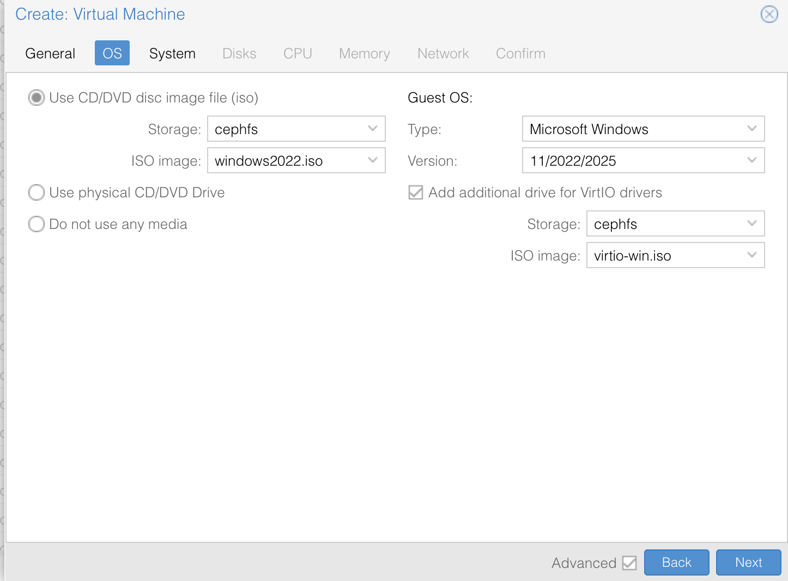
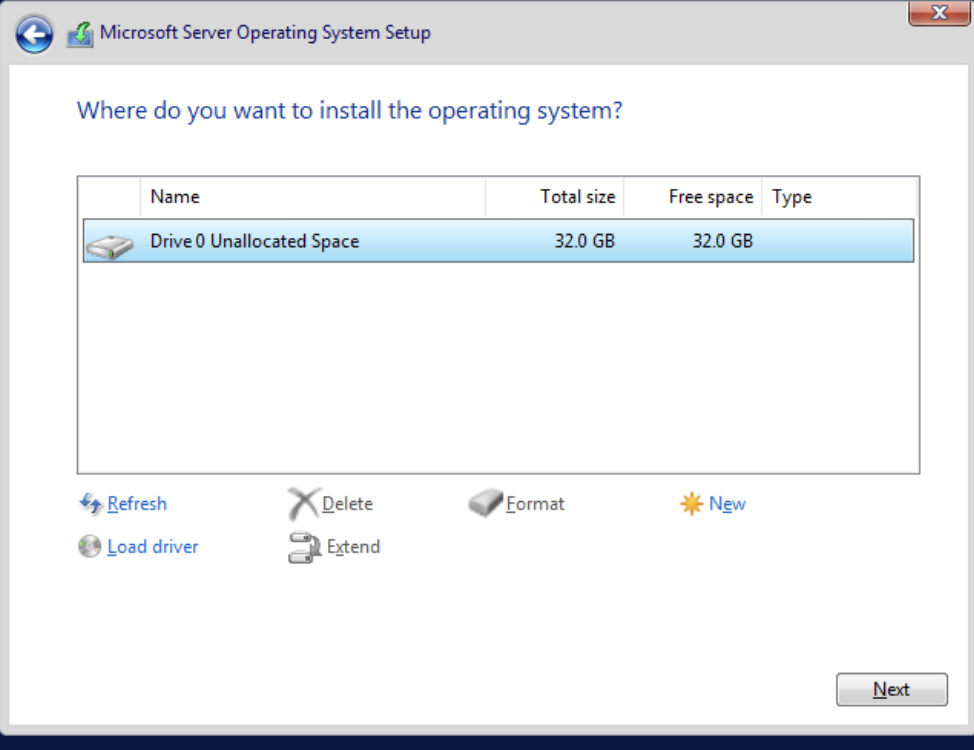

# Windows Image Preparation Steps

Windows images are supported through this plugin and cloud init needs to be configured through cloudbase-init for Morpheus to setup the Virtual machine during first boot.
The windows image also needs to have virtio drivers installed for proxmox to recognize the disk storage.

## Install Windows OS with virtio drivers

- Create a VM in proxmox with a minimum of 32 GB disk, 1 GB RAM and 1 CPU.
- On the OS tab, use the windows ISO as cdrom and select the type of OS as "windows" and the appropriate version.
- Check the option "Add additional drive for VirtIO drivers" and mount the latest mvirtio driver iso. The ISO for the virtio drivers can be downloaded from here: [Virtio Drivers](https://fedorapeople.org/groups/virt/virtio-win/direct-downloads/archive-virtio/?C=M;O=D). If you are installing windows 2012, use virtio driver version 215 or earlier.

- Select a disk for EFI and TPM in the next page.  Also, check the option "Qemu agent"
- Leave the default options for the rest of the image and click on create VM.
- Start the VM and follow the instructions as per the windows installation procedure
- At the disk selection page, if the disk is not listed, click on "Load driver" and select the path to the virtio driver. The scan process selects the drivers automatically. Install the virtio disk driver

- Once the drivers are installed, the partition can be created for installing the OS
- Continue with the rest of the windows installation.
- Once Windows is installed, select a first time user password for "Administrator" user and login. This password is temporary and we will reset it at the end of this procedure

## Configure Cloudbase-init for cloud init config
- Install Cloudbase-init software manually https://cloudbase.it/cloudbase-init/.  Install as per the wizard but do not do sysprep at the end of the installation.
- There are two config files for cloudbase-init (cloudbase-init.conf and cloudbase-init-unattend.conf).  Both will be located at C:\Program Files\Cloudbase Solutions\Cloudbase-init\conf directory
- Fill in the following values for both the files and save them

### Cloudbase-init.conf
   ```
[DEFAULT]
username=Administrator
groups=Administrators
inject_user_password=true
first_logon_behaviour=no
config_drive_raw_hhd=true
config_drive_cdrom=true
config_drive_vfat=true
rename_admin_user=true
locations=cdrom
bsdtar_path=C:\Program Files\Cloudbase Solutions\Cloudbase-Init\bin\bsdtar.exe
mtools_path=C:\Program Files\Cloudbase Solutions\Cloudbase-Init\bin\
metadata_services=cloudbaseinit.metadata.services.configdrive.ConfigDriveService
verbose=true
debug=true
mtu_use_dhcp_config=false
ntp_use_dhcp_config=false
log_dir=C:\Program Files\Cloudbase Solutions\Cloudbase-Init\log\
log_file=cloudbase-init.log
default_log_levels=comtypes=INFO,suds=INFO,iso8601=WARN,requests=WARN
logging_serial_port_settings=
local_scripts_path=C:\Program Files\Cloudbase Solutions\Cloudbase-Init\LocalScripts\
metadata_services=cloubaseinit.metadata.services.configdrive.ConfigDriveService
plugins=cloudbaseinit.plugins.common.userdata.UserDataPlugin
allow_reboot=false
check_latest_version=false
```

### Cloudbase-init-unattend.conf
```
[DEFAULT]
username=Administrator
groups=Administrators
inject_user_password=true
first_logon_behaviour=no
config_drive_raw_hhd=true
config_drive_cdrom=true
config_drive_vfat=true
rename_admin_user=true
locations=cdrom
bsdtar_path=C:\Program Files\Cloudbase Solutions\Cloudbase-Init\bin\bsdtar.exe
mtools_path=C:\Program Files\Cloudbase Solutions\Cloudbase-Init\bin\
metadata_services=cloudbaseinit.metadata.services.configdrive.ConfigDriveService
verbose=true
debug=true
mtu_use_dhcp_config=false
ntp_use_dhcp_config=false
log_dir=C:\Program Files\Cloudbase Solutions\Cloudbase-Init\log\
log_file=cloudbase-init.log
default_log_levels=comtypes=INFO,suds=INFO,iso8601=WARN,requests=WARN
logging_serial_port_settings=
local_scripts_path=C:\Program Files\Cloudbase Solutions\Cloudbase-Init\LocalScripts\
metadata_services=cloubaseinit.metadata.services.configdrive.ConfigDriveService
plugins=cloudbaseinit.plugins.common.userdata.UserDataPlugin
allow_reboot=false
check_latest_version=false
```

## Disable Firewall
- Open Windows firewall settings, turn off windows firewall for domain, private and public networks

## Run Sysprep

Sysprep prepares the system to prepare windows to a new state for new users.  This will clear the default Administrator password and delete any files/users created.  Sysprep should be run as the last step of the image building process. If you want to install any custom software or perform custom settings, do that before you run sysprep. 

- Run Sysprep:

> C:\Windows\System32\Sysprep\sysprep.exe /generalize /oobe
> /unattend:Unattend.xml

 
After following the above step, the VM should be in shut down state due to the Sysprep. Now you can make it into a template, clone it and configure it as needed.
